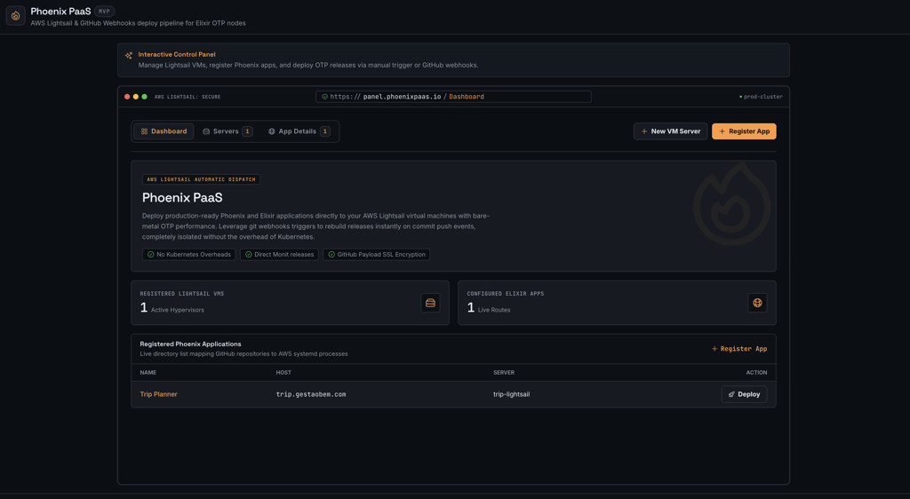

# Phoenix PaaS

Control panel for deploying Phoenix/Elixir apps to **AWS Lightsail** via GitHub webhooks.

Register Lightsail VMs, link GitHub repos, trigger manual deploys or push-to-deploy, and watch OTP release builds in a live terminal.



## Features

- **Servers** — register Lightsail VMs (IP, region, SSH user)
- **Apps** — link a GitHub repo, host, branch, and target server
- **Deployments** — queued → running → success/failed, with build logs
- **GitHub webhooks** — HMAC-verified `POST /webhooks/github`
- **Oban queue** — background deploy worker with Mox-tested runner behaviour
- **SSH deploys** — clone, build OTP release on the VM, migrate, restart systemd

## Requirements

- Elixir 1.15+ / OTP 26+
- SQLite (dev/test) — no external DB needed to get started

## Quick start

```bash
git clone https://github.com/puppe1990/phoenix-paas.git
cd phoenix-paas
mix setup
mix phx.server
```

Open [http://localhost:4000](http://localhost:4000).

## Real deploys (Lightsail SSH)

By default dev uses `FakeRunner` (simulated logs). For real deploys:

```bash
export DEPLOY_RUNNER=ssh
export GITHUB_TOKEN=ghp_...   # required for private repos
mix phx.server
```

1. Register a server with its **SSH private key (PEM)**
2. Register an app (Trip Planner defaults: `trip_planner_ia`, `/opt/trip_planner_ia`)
3. Click **Deploy now** — clones repo, builds on the VM, migrates, restarts systemd

One-off test script (no UI):

```bash
DEPLOY_RUNNER=ssh mix run --no-start priv/scripts/run_deploy_test.exs
```

Requires `git`, `ssh`, `scp`, and `tar` on the machine running the panel.

## Authentication & multi-tenant

Panel routes require login. Each user belongs to a tenant; servers and apps are isolated by `tenant_id`.

Seed the owner account and Trip Planner deploy test:

```bash
SEED_USER_PASSWORD='your-secure-password' mix run priv/repo/seeds.exs
```

This creates `matheus.puppe@gmail.com` as owner of the **Gestão Bem** tenant with the Trip Planner app pre-linked.

## Environment

| Variable | Description |
|----------|-------------|
| `DEPLOY_RUNNER` | `fake` (default) or `ssh` for real Lightsail deploys |
| `GITHUB_TOKEN` | GitHub PAT for cloning private repos |
| `PHX_SERVER` | Set to start HTTP server (e.g. in production) |
| `PORT` | HTTP port (default `4000`) |
| `SECRET_KEY_BASE` | Required in production |
| `CLOAK_KEY` | 32-byte base64 key for SSH private key encryption (production) |
| `TURSO_DATABASE_URL` | `libsql://...` Turso database URL (production) |
| `TURSO_AUTH_TOKEN` | Turso auth token (production) |
| `DATABASE_PATH` | Fallback SQLite path when Turso URL is not set |
| `SEED_USER_PASSWORD` | Password for the seeded `matheus.puppe@gmail.com` account |
| `SEED_SSH_KEY_PATH` | Optional path to Lightsail PEM for seed server (default: `~/.ssh/lightsail-default-key-us-east-1.pem`) |

## Tests

```bash
mix test
mix precommit
```

## Related

- [paas-example](https://github.com/puppe1990/paas-example) — React UI mock of this panel
- [trip-planner-ia-phx](https://github.com/puppe1990/trip-planner-ia-phx) — first production app ([trip.gestaobem.com](https://trip.gestaobem.com))

## License

MIT