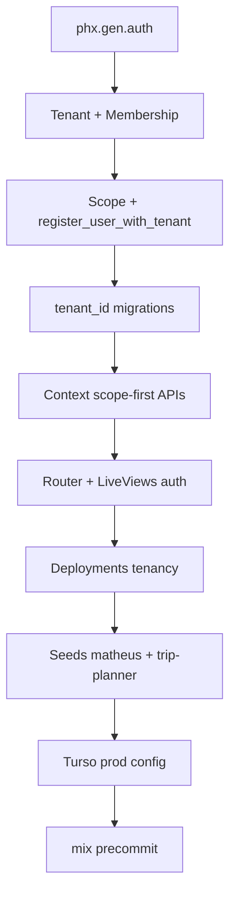

# Multi-tenant + Turso Implementation Plan

> **For agentic workers:** REQUIRED SUB-SKILL: Use superpowers:subagent-driven-development or superpowers:executing-plans. TDD mandatory — RED before GREEN on every task.

**Goal:** Isolate panel data per tenant with auth, store prod data in Turso, seed `matheus.puppe@gmail.com` as owner of the Trip Planner deploy test.

**Architecture:** `phx.gen.auth` + `Tenant` / `TenantMembership` + `tenant_id` on `servers` and `apps`. Context APIs take `%Scope{}` first. Prod uses `ecto_libsql` + Turso; dev/test keep SQLite.

**Tech Stack:** Phoenix 1.8, `phx.gen.auth`, Ecto, `ecto_libsql`, Turso, Oban, Cloak

---

## TDD test map (write these files in order)

### Phase 0 — Fixtures & Scope

| Test file | Tests |
|-----------|-------|
| `test/phoenix_paas/accounts/scope_test.exs` | builds scope from user+tenant; requires both |
| `test/support/fixtures/accounts_fixtures.ex` | `user_fixture/1`, `tenant_fixture/1`, `scope_fixture/1` |

### Phase 1 — Tenants & memberships

| Test file | Tests |
|-----------|-------|
| `test/phoenix_paas/accounts/tenant_test.exs` | changeset requires name+slug |
| `test/phoenix_paas/accounts/membership_test.exs` | user+tenant+role unique |
| `test/phoenix_paas/accounts_test.exs` | `register_user_with_tenant/1` creates user, tenant, owner membership |
| `test/phoenix_paas/accounts_test.exs` | `get_scope_for_user/1` returns scope with tenant |

### Phase 2 — Migrations & backfill

| Test file | Tests |
|-----------|-------|
| `test/phoenix_paas/tenancy_migration_test.exs` | servers/apps have `tenant_id` NOT NULL after migration |
| `test/phoenix_paas/repo/seeds_test.exs` | seeds create `matheus.puppe@gmail.com` + trip-planner app under tenant |

### Phase 3 — Context tenancy (core)

| Test file | Tests |
|-----------|-------|
| `test/phoenix_paas/servers_test.exs` | `list_servers(scope)` returns only tenant servers |
| `test/phoenix_paas/servers_test.exs` | `get_server!(scope, id)` raises for other tenant's id |
| `test/phoenix_paas/servers_test.exs` | `create_server(scope, attrs)` sets `tenant_id` from scope |
| `test/phoenix_paas/apps_test.exs` | same isolation for apps |
| `test/phoenix_paas/apps_test.exs` | slug unique per tenant, duplicate allowed across tenants |
| `test/phoenix_paas/deployments_test.exs` | `for_app(scope, app)` rejects cross-tenant app |
| `test/phoenix_paas/deployments_test.exs` | `enqueue(scope, app)` only for owned app |

### Phase 4 — Auth & HTTP

| Test file | Tests |
|-----------|-------|
| `test/phoenix_paas_web/user_auth_test.exs` | generated by `phx.gen.auth` |
| `test/phoenix_paas_web/controllers/user_session_controller_test.exs` | login/logout |
| `test/phoenix_paas_web/live/dashboard_live_test.exs` | unauthenticated → redirect login |
| `test/phoenix_paas_web/live/dashboard_live_test.exs` | authenticated sees only tenant apps |
| `test/phoenix_paas_web/live/server_live_test.exs` | cannot create server when logged out |
| `test/phoenix_paas_web/live/app_live_test.exs` | deploy button queues job for scoped app |
| `test/phoenix_paas_web/controllers/github_webhook_controller_test.exs` | still works without session |

### Phase 5 — Turso config

| Test file | Tests |
|-----------|-------|
| `test/phoenix_paas/config/turso_config_test.exs` | prod env vars produce LibSql adapter config (no live connection) |

### Phase 6 — Integration (tag `@tag :integration`)

| Test file | Tests |
|-----------|-------|
| `test/phoenix_paas/integration/tenancy_deploy_test.exs` | matheus scope sees trip-planner; other user does not |

---

## File structure (new / modified)

```
lib/phoenix_paas/
  accounts/
    user.ex              # phx.gen.auth
    user_token.ex
    tenant.ex            # NEW
    tenant_membership.ex # NEW
    scope.ex             # NEW — %Scope{user, tenant, role}
    accounts.ex          # NEW — register, get_scope
  servers.ex             # MODIFY — scope-first APIs
  apps.ex                  # MODIFY
  deployments.ex           # MODIFY

lib/phoenix_paas_web/
  user_auth.ex             # phx.gen.auth
  paas_mount.ex            # MODIFY — require tenant
  router.ex                # MODIFY — auth pipelines + live_session

priv/repo/migrations/
  *_create_users_auth_tables.exs   # phx.gen.auth
  *_create_tenants.exs             # NEW
  *_add_tenant_id_to_resources.exs # NEW

config/
  runtime.exs              # MODIFY — Turso prod block
  dev.exs / test.exs         # unchanged SQLite

mix.exs                      # add ecto_libsql
priv/repo/seeds.exs          # matheus + trip-planner backfill
```

---

## Implementation tasks (TDD checkpoints)

### Task 1: Generate auth scaffold

**Files:**
- Run: `mix phx.gen.auth Accounts User users`
- Modify: `lib/phoenix_paas_web/router.ex`

- [ ] **Step 1:** Run generator, fix compile errors
- [ ] **Step 2:** Run `mix test test/phoenix_paas_web/user_auth_test.exs` — GREEN
- [ ] **Step 3:** Commit `feat: add phx.gen.auth scaffold`

### Task 2: Tenant schema

**Files:**
- Create: `lib/phoenix_paas/accounts/tenant.ex`
- Create: `lib/phoenix_paas/accounts/tenant_membership.ex`
- Create: migration `create_tenants`
- Test: `test/phoenix_paas/accounts/tenant_test.exs`

- [ ] **Step 1: RED** — test tenant changeset valid/invalid
- [ ] **Step 2: GREEN** — schema + migration
- [ ] **Step 3: RED** — membership unique constraint test
- [ ] **Step 4: GREEN** — membership schema
- [ ] **Step 5:** `mix test` — commit

### Task 3: Scope + register with tenant

**Files:**
- Create: `lib/phoenix_paas/accounts/scope.ex`
- Modify: `lib/phoenix_paas/accounts.ex`
- Test: `test/phoenix_paas/accounts_test.exs`
- Create: `test/support/fixtures/accounts_fixtures.ex`

- [ ] **Step 1: RED**

```elixir
test "register_user_with_tenant/1 creates owner membership" do
  {:ok, %{user: user, tenant: tenant}} =
    Accounts.register_user_with_tenant(%{email: "a@b.com", password: "password123456"})

  assert user.email == "a@b.com"
  assert tenant.slug == "a-b-com" # or derived slug
  assert Accounts.get_scope_for_user(user).tenant.id == tenant.id
end
```

- [ ] **Step 2: GREEN** — minimal implementation
- [ ] **Step 3:** Commit

### Task 4: Add tenant_id to servers & apps

**Files:**
- Migration: `add_tenant_id_to_servers_and_apps`
- Modify: `server.ex`, `app.ex`, `servers.ex`, `apps.ex`
- Test: update `servers_test.exs`, `apps_test.exs`

- [ ] **Step 1: RED**

```elixir
test "list_servers/1 returns only current tenant" do
  scope_a = scope_fixture()
  scope_b = scope_fixture()
  {:ok, _} = Servers.create_server(scope_a, %{name: "a", host_ip: "10.0.0.1", ...})
  {:ok, _} = Servers.create_server(scope_b, %{name: "b", host_ip: "10.0.0.2", ...})

  assert length(Servers.list_servers(scope_a)) == 1
  assert hd(Servers.list_servers(scope_a)).name == "a"
end
```

- [ ] **Step 2: GREEN**
- [ ] **Step 3: RED** — cross-tenant `get_server!` raises
- [ ] **Step 4: GREEN**
- [ ] **Step 5:** Repeat for Apps
- [ ] **Step 6:** Drop global unique indexes; add `[:tenant_id, :slug]` unique
- [ ] **Step 7:** Commit

### Task 5: Wire auth to router & LiveViews

**Files:**
- Modify: `router.ex`, `paas_mount.ex`, all `*Live` modules
- Test: `dashboard_live_test.exs`, `server_live_test.exs`, `app_live_test.exs`

- [ ] **Step 1: RED** — `conn` without login GET `/` → redirect `/users/log-in`
- [ ] **Step 2: GREEN** — `pipe_through [:browser, :require_authenticated_user]`
- [ ] **Step 3: RED** — logged-in user sees scoped dashboard counts
- [ ] **Step 4: GREEN** — pass `current_scope` to context in LiveViews
- [ ] **Step 5:** Update all existing tests to use `log_in_user` + `scope_fixture`
- [ ] **Step 6:** Commit

### Task 6: Deployments tenancy

**Files:**
- Modify: `deployments.ex`, `deploy_worker.ex` (verify app tenant)
- Test: `deployments_test.exs`, `deploy_worker_test.exs`

- [ ] **Step 1: RED** — enqueue with wrong scope fails
- [ ] **Step 2: GREEN**
- [ ] **Step 3:** Commit

### Task 7: Seeds — matheus.puppe@gmail.com

**Files:**
- Modify: `priv/repo/seeds.exs`
- Test: `test/phoenix_paas/repo/seeds_test.exs`

- [ ] **Step 1: RED**

```elixir
test "seeds assign trip-planner to matheus tenant" do
  Seeds.run()
  user = Accounts.get_user_by_email("matheus.puppe@gmail.com")
  scope = Accounts.get_scope_for_user(user)
  apps = Apps.list_apps(scope)
  assert Enum.any?(apps, &(&1.slug == "trip-planner"))
end
```

- [ ] **Step 2: GREEN** — idempotent seed with `SEED_USER_PASSWORD`
- [ ] **Step 3:** Commit

### Task 8: Turso prod config

**Files:**
- Modify: `mix.exs`, `config/runtime.exs`
- Test: `test/phoenix_paas/config/turso_config_test.exs`

- [ ] **Step 1: RED** — assert config module builds LibSql URI config from env
- [ ] **Step 2: GREEN** — copy pattern from trip-planner `runtime.exs`
- [ ] **Step 3:** Document env vars in README
- [ ] **Step 4:** Commit

### Task 9: Integration test + precommit

- [ ] **Step 1:** `@tag :integration` tenancy deploy visibility test
- [ ] **Step 2:** `mix precommit` — all green
- [ ] **Step 3:** Final commit

---

## Migration SQL sketch

```sql
-- tenants
CREATE TABLE tenants (id INTEGER PRIMARY KEY, name TEXT NOT NULL, slug TEXT NOT NULL, ...);
CREATE UNIQUE INDEX tenants_slug_index ON tenants(slug);

-- tenant_memberships
CREATE TABLE tenant_memberships (
  id INTEGER PRIMARY KEY,
  user_id INTEGER REFERENCES users(id),
  tenant_id INTEGER REFERENCES tenants(id),
  role TEXT NOT NULL DEFAULT 'owner',
  ...
);
CREATE UNIQUE INDEX tenant_memberships_user_tenant_index ON tenant_memberships(user_id, tenant_id);

-- backfill (dev DB with existing data)
ALTER TABLE servers ADD COLUMN tenant_id INTEGER REFERENCES tenants(id);
ALTER TABLE apps ADD COLUMN tenant_id INTEGER REFERENCES tenants(id);
-- seed creates gestao-bem tenant, updates existing rows, then NOT NULL
```

---

## Env vars (prod)

| Variable | Purpose |
|----------|---------|
| `TURSO_DATABASE_URL` | `libsql://...` |
| `TURSO_AUTH_TOKEN` | Turso auth |
| `SECRET_KEY_BASE` | Phoenix |
| `CLOAK_KEY` | SSH key encryption (32-byte base64) |
| `SEED_USER_PASSWORD` | One-time seed for matheus account |
| `DEPLOY_RUNNER` | `ssh` in prod |

---

## Estimated effort

| Phase | Tasks | Tests added |
|-------|-------|-------------|
| Auth scaffold | 1 | ~8 (generated) |
| Tenancy core | 2–4 | ~15 |
| LiveView wire | 5 | ~8 |
| Seeds + Turso | 7–8 | ~4 |
| **Total** | **9 tasks** | **~35 new/updated** |

---

## Execution order diagram

